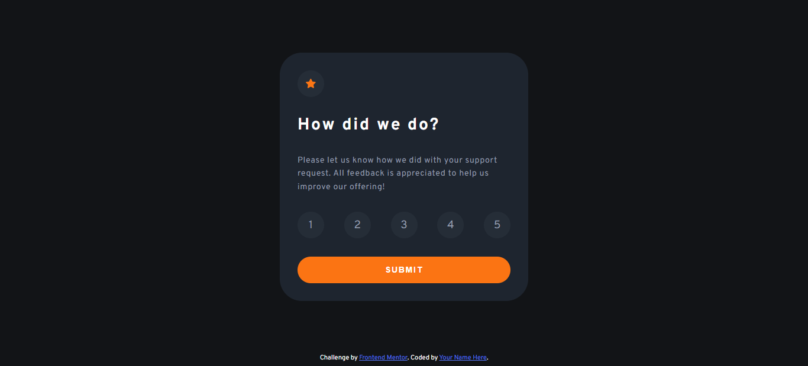

# Frontend Mentor - Interactive rating component solution

This is a solution to the [Interactive rating component challenge on Frontend Mentor](https://www.frontendmentor.io/challenges/interactive-rating-component-koxpeBUmI). Frontend Mentor challenges help you improve your coding skills by building realistic projects. 

## Table of contents

- [Overview](#overview)
  - [The challenge](#the-challenge)
  - [Screenshot](#screenshot)
  - [Links](#links)
- [My process](#my-process)
  - [Built with](#built-with)
  - [What I learned](#what-i-learned)
- [Author](#author)
- [Acknowledgments](#acknowledgments)


## Overview

### The challenge

Users should be able to:

- View the optimal layout for the app depending on their device's screen size
- See hover states for all interactive elements on the page
- Select and submit a number rating
- See the "Thank you" card state after submitting a rating

### Screenshot



### Links

- [Solution URL](https://ahmetwithat.github.io/interactive-rating-component)

## My process

### Built with

- Semantic HTML5 markup
- CSS custom properties
- Flexbox
- Mobile-first workflow
- JavaScript DOM manipulation

### What I learned

I learned how to use some aria role and properties to make the component accessible.

```html
<div role="radiogroup" class="js-rating rating flex-row">
  <div role="radio" aria-checked="false" class="user-rating-button circle-bg flex-center">1</div>
  <div role="radio" aria-checked="false" class="user-rating-button circle-bg flex-center">2</div>
  <div role="radio" aria-checked="false" class="user-rating-button circle-bg flex-center">3</div>
  <div role="radio" aria-checked="false" class="user-rating-button circle-bg flex-center">4</div>
  <div role="radio" aria-checked="false" class="user-rating-button circle-bg flex-center">5</div>
</div>
```

First time using event delegation!
```js
rating.addEventListener("click", (e) => {
  let target = e.target;
  checkboxCleanup();
  target.setAttribute("aria-checked", true);
});
```

## Author

- Website - [ahmetwithat](https://ahmetwithat.github.io)
- Frontend Mentor - [@ahmetwithat](https://www.frontendmentor.io/profile/ahmetwithat)


## Acknowledgments

Thanks to Grace Snow from Frontend Mentor for all the tips! She helped me a ton with my last challenge and I used the tips she gave me in this challenge to make this both more accessible and more disciplined/clean.